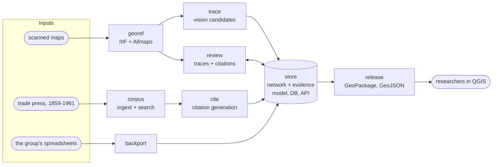

# Lineage

Lineage reconstructs the history of physical networks - gas and oil pipelines, electric
transmission, water mains, roads - as temporal GIS data recovered from the archival record.
Every fact about a line carries a citation to the source that says so.

The name is a pun (line + age) that also happens to be the GIS term for a dataset's
provenance, which is the whole idea.

It grew out of [Legend](https://github.com/Tight-Line/legend), a spike run with a
university research group. Their interest is a timeline of US energy distribution as an
input to research and policy. Tight Line's interest is the agentic extraction research.

This repository is the controlplane. It holds no code. It says which pieces exist, what goes
in and out of each, who needs them first, and where each one is built. It does not say how
they are built; that belongs in the component repos.

## What it has to do

In order of priority:

1. Data usable in QGIS and field-standard tools, without conversion or plugins.
2. Temporal, with imprecise dates.
3. Citations, optionally with confidence.
4. Trackable evolution - who changed what, when, and on what evidence.

(4) used to mean "the git history". It now means an audit trail in the database; see
[decisions](decisions.md) L-0001.

## The pieces

| Repo | What it is | First needed |
| --- | --- | --- |
| [`store`](https://github.com/line-age/store) | the network + evidence model, PostGIS, the audited CRUD API | Fall 2026 |
| [`corpus`](https://github.com/line-age/corpus) | trade-press ingest and an authority-ranked RAG search over it | Fall 2026 |
| [`cite`](https://github.com/line-age/cite) | segments in, grounded citations out | Fall 2026, first |
| [`georef`](https://github.com/line-age/georef) | IIIF image serving, self-hosted Allmaps, our annotation server | Fall 2026 |
| [`trace`](https://github.com/line-age/trace) | georeferenced maps in, candidate segments out | Fall 2026, research |
| [`backport`](https://github.com/line-age/backport) | the group's existing spreadsheets into `store` | Fall 2026, side quest |
| [`review`](https://github.com/line-age/review) | authenticated review of traces and citations | Winter 2027 |
| [`release`](https://github.com/line-age/release) | `store` out to versioned GeoPackage and GeoJSON | Winter 2027 |

Detail per component, including inputs, outputs and open questions, is in
[components.md](components.md). Timing is in [roadmap.md](roadmap.md).

## Where things are written down

- [components.md](components.md) - each piece, its inputs and outputs, what it depends on
- [roadmap.md](roadmap.md) - fall, winter, spring
- [decisions.md](decisions.md) - what we have decided for Lineage, and what we inherited from Legend
- [open-questions.md](open-questions.md) - what is not decided, and whose call it is
- [glossary.md](glossary.md) - the words, so every repo uses them the same way
